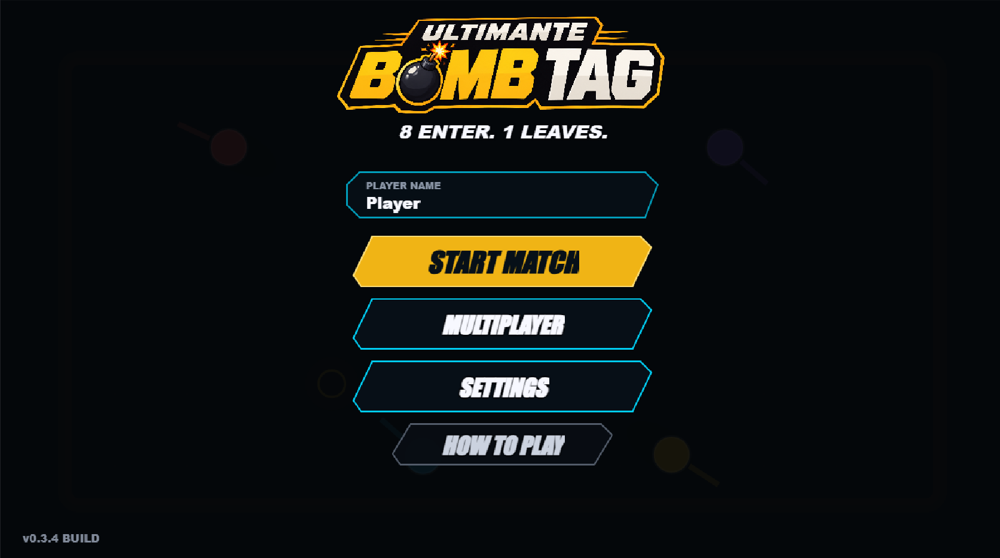
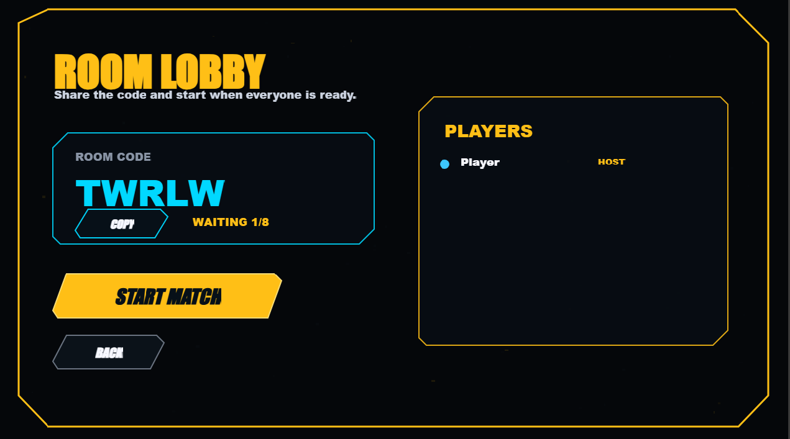

<div align="center">

# 💣 ULTIMANTE BOMB TAG

### 8 jogadores entram. 1 sai.

Um party game competitivo de arena que mistura **batata quente com bomba, movimentação rápida, dash, tiros, parry e finais caóticos**.

<br>

[](https://bomb-tag-v1.vercel.app/)

[](https://github.com/EmanuelFHX/Bomb-Tag-v1)

<br>


</div>

---

## ⚠️ Estado atual

> **Ultimante Bomb Tag está em desenvolvimento ativo.**
>
> Mecânicas, interface, balanceamento, modos de jogo e sistemas apresentados atualmente podem mudar ao longo do desenvolvimento.
>
> O modo com bots é atualmente a experiência mais estável. O **multiplayer online é experimental e ainda pode apresentar problemas de sincronização, conexão e comportamento durante as partidas**.

---

## 🎮 Sobre o jogo

**Ultimante Bomb Tag** é um jogo competitivo de arena em tempo real onde até **8 jogadores** entram em uma partida de sobrevivência e apenas **1 sai vencedor**.

A base do jogo combina a tensão de uma **batata quente com uma bomba** com movimentação rápida, mira, dash, armas, ricochetes, parry e fases que ficam progressivamente mais intensas conforme os jogadores são eliminados.

A partida começa relativamente simples, mas evolui até confrontos especiais e pode culminar na **Hora do Julgamento**, uma fase final criada para transformar o encerramento da partida em um momento caótico e cinematográfico.

---

## 🌐 Jogue agora

### 🎮 [Acessar Ultimante Bomb Tag](https://bomb-tag-v1.vercel.app/)

O jogo roda diretamente no navegador.

Para a melhor experiência atual, recomenda-se jogar no **desktop**.

---

## 🖼️ Preview

### Menu principal



---

### Lobby Multiplayer



---

## 🎥 Gameplay

O repositório também possui uma demonstração em vídeo:

### [▶️ Assistir demo de gameplay](./demo/demo-video.mp4)

---

# 💣 Mecânica principal

Uma bomba circula entre os jogadores durante a partida.

O objetivo é simples:

> **Não esteja com ela quando o tempo acabar.**

```text
Jogador A
    │
    │ lança
    ▼
   💣 ──────────────► Jogador B
                         │
                         │ recebe
                         ▼
                        💣
                         │
                         │ lança
                         ▼
                     Jogador C
```

Se o tempo chegar a zero enquanto um jogador estiver com a bomba, ele pode ser eliminado.

Mas simplesmente lançar a bomba não garante segurança.

Ela pode:

- acertar outro jogador;
- ricochetear;
- continuar perigosa durante o retorno;
- voltar para quem realizou o lançamento.

---

# ⚔️ Mecânicas principais

## 💣 Bomba

- Passa entre os jogadores
- Possui timer
- Pode ricochetear
- Pode retornar ao lançador
- Continua capaz de acertar jogadores durante o retorno
- Torna-se cada vez mais perigosa conforme a partida avança

---

## 💨 Dash

O dash permite realizar um avanço rápido pela arena.

Ele pode ser utilizado para:

- escapar da bomba;
- reposicionar-se;
- atravessar situações perigosas;
- criar oportunidades ofensivas.

Durante um pequeno intervalo do movimento, o jogador recebe uma janela curta de invulnerabilidade.

Na rodada especial, o dash passa a utilizar um sistema de recarga.

---

## 🔫 Armas

Armas podem surgir durante determinadas fases da partida.

Os jogadores podem utilizá-las para causar dano e reduzir as vidas dos adversários.

As armas adicionam uma segunda camada de ameaça além da própria bomba.

---

## 🛡️ Parry

Durante fases especiais, o jogador pode utilizar **parry** para responder a ataques no momento correto.

Um parry bem executado pode:

- devolver a bomba;
- alterar o ritmo do confronto;
- criar uma oportunidade de contra-ataque.

---

## 🔄 Giro de 180°

Um movimento de 180 graus enquanto o jogador possui a bomba pode gerar um arremesso mais rápido.

Na rodada especial, essa mecânica também pode ser utilizada para **quebrar o parry de um adversário**.

---

# 📈 Progressão da partida

A partida muda conforme o número de sobreviventes diminui.

```text
8 jogadores
     │
     ▼
Rodada normal
     │
     ▼
Eliminações
     │
     ▼
4 jogadores
     │
     ▼
3 jogadores
     │
     ▼
⚠️ RODADA ESPECIAL
     │
     ▼
2 jogadores
     │
     ▼
1v1
     │
     ├───────────────┐
     │               │
     ▼               ▼
Vitória        Condição especial
                     │
                     ▼
              🔔 HORA DO JULGAMENTO
```

---

# ⚠️ Rodada Especial

Quando restam **3 jogadores**, a partida entra em uma nova fase.

A entrada da rodada especial é marcada por mudanças visuais, sonoras e mecânicas.

### O que muda

- ❤️ As vidas são restauradas para **3**
- 💨 O dash passa a possuir recarga
- 🏟️ A arena fica menor
- 🎵 A música muda
- 🎬 Uma cutscene anuncia a nova fase
- 🔫 Armas ganham maior importância
- 🛡️ Parry passa a fazer parte do confronto
- 📊 Um placar lateral apresenta informações da rodada

A ideia é aumentar progressivamente a pressão até restarem apenas dois jogadores.

---

# 🟡 O caminho para o Julgamento

Durante o **1v1 da rodada especial**, pequenas esferas douradas podem aparecer na arena.

Se um jogador coletar:

```text
🟡 + 🟡 + 🟡
     │
     ▼
   🔔 SINO
     │
     ▼
JULGAMENTO MARCADO
```

Ao obter três esferas, o sino toca e o outro jogador passa a estar marcado para a **Hora do Julgamento**.

A fase não interrompe imediatamente o confronto atual.

A **Hora do Julgamento começa apenas quando a fase em andamento termina**.

---

# 🔔 Hora do Julgamento

> **DEFENDA SUA POSIÇÃO.**

A Hora do Julgamento é uma fase especial desbloqueada por uma condição específica durante o 1v1.

A arena é completamente alterada.

O jogador condenado é colocado no centro enquanto jogadores anteriormente eliminados retornam para uma última tentativa de derrubá-lo.

```text
            Jogador
               ●

      ●                   ●


            ┌─────┐
            │     │
            │  👑 │
            │     │
            └─────┘


      ●                   ●

               ●
```

### Durante o Julgamento

- O jogador condenado ocupa o círculo central
- Jogadores eliminados revivem ao redor da arena
- A arena assume um formato circular
- Jogadores externos utilizam a bomba para atacar o centro
- O jogador central precisa defender sua posição
- Armas podem surgir para o jogador central
- Música exclusiva acompanha a fase
- Uma cutscene marca o início do Julgamento

---

## 🏆 Condições finais

### O jogador central sobrevive

Se conseguir defender sua posição até o final:

> **ele vence a partida.**

### O jogador central é eliminado

Se outro jogador conseguir derrotá-lo:

```text
Jogador que eliminou o central
             VS
       Jogador central
              │
              ▼
       ⚔️ COMBATE FINAL
```

Os dois seguem para um confronto definitivo.

---

# 🌐 Multiplayer Online

Ultimante Bomb Tag possui uma implementação inicial de multiplayer utilizando **Firebase Realtime Database**.

O sistema atual é baseado em **salas privadas com código**, sem matchmaking público.

### Fluxo

```text
HOST
 │
 ▼
Criar sala
 │
 ▼
Código gerado
 │
 ├─────────────────────────┐
 │                         │
 ▼                         ▼
Host                    Convidados
 │                         │
 └──────────┬──────────────┘
            ▼
          Lobby
            │
            ▼
       Iniciar partida
```

### Atualmente já existe

- Criação de sala
- Código de convite
- Entrada por código
- Lobby de espera
- Identificação do host
- Participação dos convidados na partida
- Sincronização inicial do estado via Firebase

Entre os sistemas que já passaram por trabalho de sincronização estão:

- posição dos jogadores;
- bomba;
- tiros;
- armas;
- dash;
- sons de hit;
- cutscenes;
- cards de fase;
- indicadores visuais;
- eventos importantes da rodada.

---

## ⚠️ Multiplayer experimental

O multiplayer ainda está em uma fase inicial.

Atualmente podem ocorrer:

- dessincronizações;
- diferenças de posição entre jogadores;
- eventos acontecendo em momentos diferentes;
- problemas de reconexão;
- inconsistências durante mudanças de fase;
- comportamento inesperado da bomba ou de outros objetos.

O objetivo atual é evoluir gradualmente a sincronização até que as partidas online tenham a mesma consistência do modo local.

---

# 🤖 Bots

O jogo já possui partidas jogáveis contra bots.

O modo com bots é utilizado atualmente tanto como experiência principal quanto para testar:

- novas mecânicas;
- balanceamento;
- armas;
- progressão das fases;
- efeitos;
- áudio;
- interface;
- comportamento da bomba;
- condições especiais.

---

# 📱 Mobile

Uma versão para dispositivos móveis também está em desenvolvimento.

### Já implementado

- 🕹️ Joystick virtual
- 💣 Botão para lançar a bomba
- 🔫 Botão de ação para armas
- 💨 Botão de dash
- 🛡️ Botão de parry
- 👆 Suporte a multitouch
- 📺 Tentativa de fullscreen
- 🔄 Aviso para girar o dispositivo
- ↔️ Gameplay bloqueada na orientação horizontal

> O suporte mobile ainda está sendo ajustado e pode sofrer alterações significativas.

---

# 🎵 Áudio

A música e os efeitos sonoros fazem parte da progressão da partida.

O sistema atual possui:

- 🎵 Música da rodada normal
- ⚔️ Música da rodada especial
- 🔔 Música exclusiva da Hora do Julgamento
- 🔉 Fade-in e fade-out entre músicas
- 🔔 Sino do Julgamento
- 💥 Som de hit
- ❤️ Som de dano
- 🛡️ Som de parry
- 💣 Feedback sonoro da bomba
- ⏱️ Tic-tac próximo ao fim do timer

Cada mudança de fase busca utilizar o áudio para aumentar a tensão da partida.

---

# 🎨 Visual e UX

O jogo vem recebendo melhorias constantes na apresentação.

Entre os elementos já implementados estão:

- Menu principal redesenhado
- Gameplay desfocada ao fundo do menu
- Tela de lobby
- Modal para nome do jogador
- Modal para entrar em sala
- HUD de partida
- Timer
- Indicador da bomba
- Indicadores de vidas
- Indicador de dash
- Placar lateral da rodada especial
- Feedback visual de dano
- Aviso `-1 VIDA`
- Rastro da bomba
- Bola em chamas após parry perfeito
- Mira da bomba teleguiada
- Cards de mudança de fase
- Cutscene da rodada especial
- Cutscene da Hora do Julgamento

---

# 🛠️ Tecnologias

**Phaser, TypeScript, Vite, Firebase Realtime Database, HTML, CSS, Vercel**

| Tecnologia | Uso |
|---|---|
| **Phaser** | Engine principal do jogo |
| **TypeScript** | Lógica e tipagem do projeto |
| **Vite** | Ambiente de desenvolvimento e build |
| **Firebase Realtime Database** | Sincronização inicial do multiplayer |
| **HTML / CSS** | Interface e elementos externos ao canvas |
| **Vercel** | Deploy da versão web |

---

# 🏗️ Estrutura

O projeto é organizado para permitir a evolução separada do cliente, sistemas online e documentação.

```text
Bomb-Tag-v1/
│
├── frontend/
│   ├── public/
│   │   ├── audio/
│   │   └── images/
│   │
│   ├── src/
│   ├── index.html
│   ├── package.json
│   ├── tsconfig.json
│   └── vite.config.ts
│
├── backend/
├── firebase/
├── shared/
├── qa/
│
├── docs/
│   ├── BRANCHING.md
│   └── FIREBASE_PREP.md
│
├── demo/
│   ├── Menu.png
│   ├── Lobby-Multiplayer.png
│   └── demo-video.mp4
│
└── README.md
```

---

# 🚀 Executando localmente

## Pré-requisitos

- Node.js
- npm

### 1. Clone o repositório

```bash
git clone https://github.com/EmanuelFHX/Bomb-Tag-v1.git
```

### 2. Entre no frontend

```bash
cd Bomb-Tag-v1/frontend
```

### 3. Instale as dependências

```bash
npm install
```

### 4. Configure o Firebase

Utilize o arquivo:

```text
.env.example
```

como referência para criar suas variáveis locais.

### 5. Execute

```bash
npm run dev
```

O Vite exibirá o endereço local no terminal.

---

# 📦 Build

Para gerar a versão de produção:

```bash
npm run build
```

Para visualizar a build localmente:

```bash
npm run preview
```

---

# 🗺️ Roadmap

## ✅ Implementado

- [x] Movimentação
- [x] Mira
- [x] Sistema de bomba
- [x] Ricochete e retorno da bomba
- [x] Bots
- [x] Timer
- [x] Eliminações
- [x] Dash
- [x] Sistema de vidas
- [x] Armas
- [x] Tiros
- [x] Rodada especial
- [x] Parry
- [x] Giro de 180°
- [x] Música dinâmica
- [x] Efeitos sonoros
- [x] Sistema de fases
- [x] Condição para Hora do Julgamento
- [x] Hora do Julgamento
- [x] Menu principal
- [x] HUD
- [x] Lobby multiplayer
- [x] Salas privadas por código
- [x] Base de sincronização via Firebase
- [x] Controles mobile iniciais
- [x] Deploy web

---

## 🚧 Em desenvolvimento

- [ ] Estabilização do multiplayer
- [ ] Melhor sincronização da bomba
- [ ] Melhor sincronização de jogadores
- [ ] Reconexão multiplayer
- [ ] Melhorias no lobby
- [ ] Balanceamento das armas
- [ ] Refinamento da inteligência dos bots
- [ ] Ajustes da Hora do Julgamento
- [ ] Melhorias dos controles mobile
- [ ] Responsividade mobile
- [ ] Polimento das animações
- [ ] Melhorias de performance

---

## 🔮 Futuro

- [ ] Multiplayer online mais estável
- [ ] Ranking privado
- [ ] Estatísticas de partidas
- [ ] Tela de vitória cinematográfica
- [ ] Novas armas
- [ ] Novas condições especiais
- [ ] Novos eventos de arena
- [ ] Customização de jogadores
- [ ] Melhorias no matchmaking privado
- [ ] Modo replay
- [ ] Modo demo para gravações
- [ ] Integração mais completa com Firebase
- [ ] Trailer e materiais de divulgação
- [ ] Mais polimento visual e sonoro

---

# 🎯 Visão do projeto

A visão do **Ultimante Bomb Tag** é criar um jogo competitivo de navegador que seja fácil de entender, rápido de jogar e difícil de dominar.

As partidas devem começar simples e ficar progressivamente mais caóticas até chegar a finais em que cada movimento pode decidir o vencedor.

O projeto continuará recebendo mudanças de mecânicas, balanceamento, interface, conteúdo e infraestrutura conforme o desenvolvimento avança.

---

# ⚠️ Aviso de desenvolvimento

Este repositório representa um projeto em evolução.

Funcionalidades apresentadas no README podem:

- ser modificadas;
- ser substituídas;
- receber novos comportamentos;
- ser temporariamente desativadas;
- mudar de aparência;
- mudar de balanceamento.

O objetivo do repositório é acompanhar a evolução pública do **Ultimante Bomb Tag**, e não representar uma versão final do jogo.

---

# 🔗 Links

🎮 **Jogar:**  
https://bomb-tag-v1.vercel.app/

💻 **Repositório:**  
https://github.com/EmanuelFHX/Bomb-Tag-v1

---

# 👨‍💻 Autor

**Emanuel Penna**

[](https://github.com/EmanuelFHX)

[](https://www.linkedin.com/in/emanuel-penna)

[](https://portfolio-emanuel-penna.vercel.app/)
